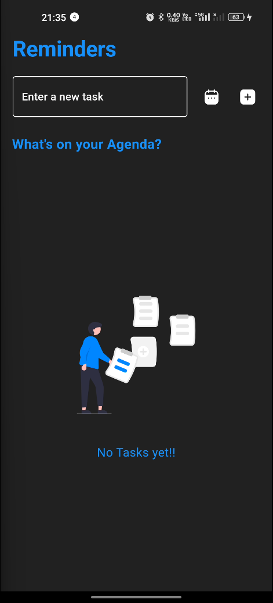
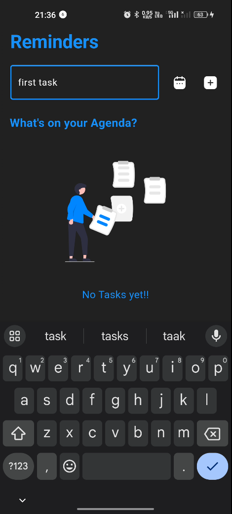
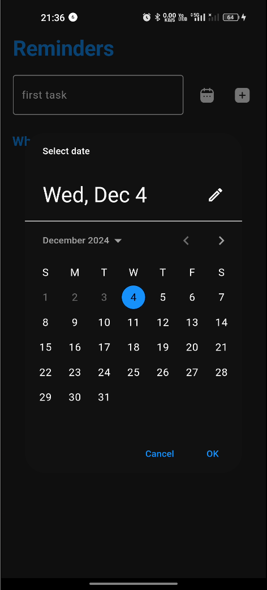
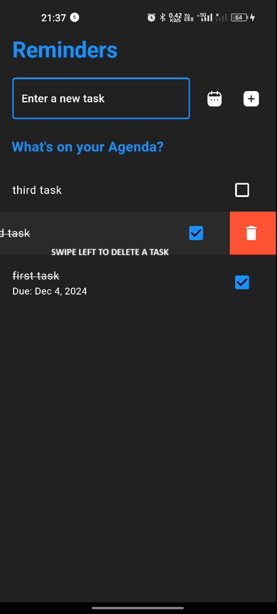

# Reminder App

[](https://firebase.google.com/)
[](https://flutter.dev/)
[](https://dart.dev/)

A Flutter-based mobile application for basic reminders.

## ⚡️ Features

- **Task Management**: Create, update, and track reminders with due dates.
- **Responsive UI**: Clean and intuitive user interface designed with Flutter.
- **Real-time Updates**: Utilizes Firebase for real-time data synchronization.
- **Notification Service**: Utilizes Firebase for notifications.

## Screenshots

<table>
  <tr>
    <td></td>
    <td></td>
    <td></td>
    <td></td>
  </tr>
  
</table>

## 👩‍💻 Technologies Used

- Flutter 2.x
- Dart 2.x
- Firebase (Authentication, Firestore)
- Provider (State Management)

## 🚀 Getting Started

### Prerequisites

- Flutter SDK
- Dart SDK
- Android Studio / VS Code
- Firebase account

### Installation

1. Clone the repository:
   ```
   git clone https://github.com/SanjayKParida/reminder-app.git
   ```
2. Navigate to the project directory:
   ```
   cd reminder-app
   ```
3. Install dependencies:
   ```
   flutter pub get
   ```
4. Set up Firebase:

   - Create a new Firebase project
   - Add an Android app to your Firebase project
   - Download the `google-services.json` file and place it in the `android/app` directory
   - Add an iOS app to your Firebase project
   - Download the `GoogleService-Info.plist` file and place it in the `ios/Runner` directory

5. Run the app:
   ```
   flutter run
   ```

## Project Structure

```
lib/
├── config/
│   └── theme.dart
├── features/
│   └── tasks/
├── services/
│   └── notification_service.dart
├── shared/
│   └── widgets/
├── firebase_options.dart
└── main.dart
```

## Contact

Sanjay Kumar Parida - [kumarparidasanjay23@gmail.com](mailto:kumarparidasanjay23@gmail.com)

Project Link: [https://github.com/SanjayKParida/reminder-app](https://github.com/SanjayKParida/reminder-app)
